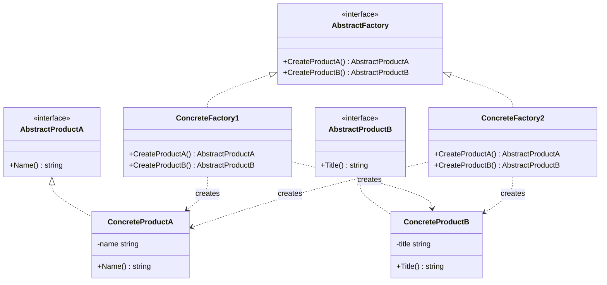

```mermaid
classDiagram
    class AbstractFactory {
        <<interface>>
        +CreateProductA() AbstractProductA
        +CreateProductB() AbstractProductB
    }

    class ConcreteFactory1 {
        +CreateProductA() AbstractProductA
        +CreateProductB() AbstractProductB
    }

    class ConcreteFactory2 {
        +CreateProductA() AbstractProductA
        +CreateProductB() AbstractProductB
    }

    class AbstractProductA {
        <<interface>>
        +Name() string
    }

    class AbstractProductB {
        <<interface>>
        +Title() string
    }

    class ConcreteProductA {
        -name string
        +Name() string
    }

    class ConcreteProductB {
        -title string
        +Title() string
    }

    AbstractFactory <|.. ConcreteFactory1
    AbstractFactory <|.. ConcreteFactory2
    AbstractProductA <|.. ConcreteProductA
    AbstractProductB <|.. ConcreteProductB
    ConcreteFactory1 ..> ConcreteProductA : creates
    ConcreteFactory1 ..> ConcreteProductB : creates
    ConcreteFactory2 ..> ConcreteProductA : creates
    ConcreteFactory2 ..> ConcreteProductB : creates
```
