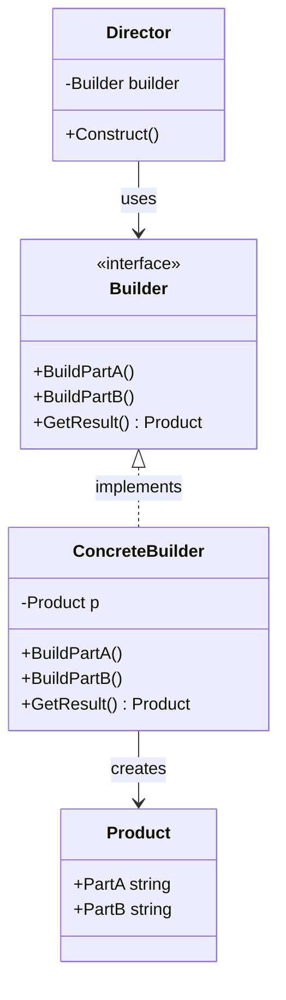

# Builder Pattern

```mermaid
classDiagram
    class Director {
        -Builder builder
        +Construct()
    }

    class Builder {
        <<interface>>
        +BuildPartA()
        +BuildPartB()
        +GetResult() Product
    }

    class ConcreteBuilder {
        -Product p
        +BuildPartA()
        +BuildPartB()
        +GetResult() Product
    }

    class Product {
        +PartA string
        +PartB string
    }

    Director --> Builder : uses
    Builder <|.. ConcreteBuilder : implements
    ConcreteBuilder --> Product : creates
```
