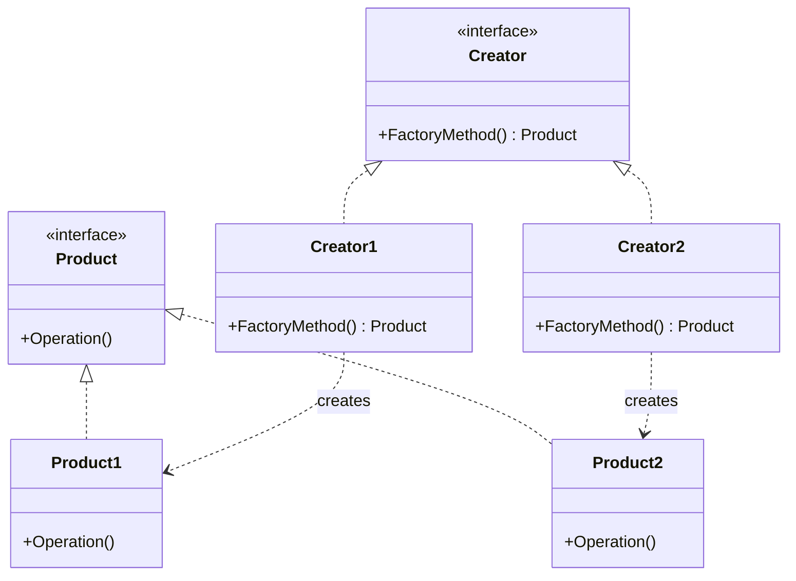

# Factory Method Pattern

## Overview

The Factory Method pattern defines an interface for creating an object, but lets subclasses decide which class to instantiate. It lets a class defer instantiation to subclasses.

## Structure



## Usage

```go
func main() {
    fmt.Println("Creator1:")
    clientCode(&Creator1{})
    fmt.Println("Creator2:")
    clientCode(&Creator2{})
}
```
