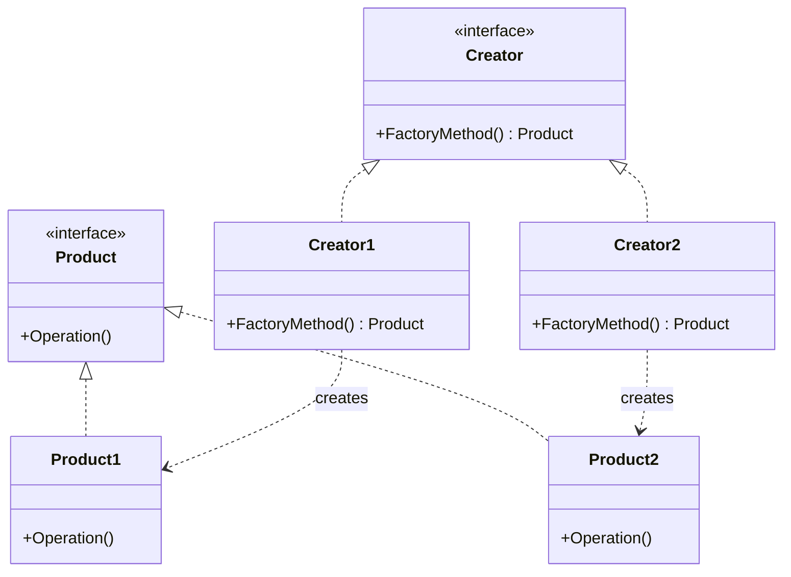

# Factory Method Pattern

```mermaid
classDiagram
    class Product {
        <<interface>>
        +Operation()
    }

    class Product1 {
        +Operation()
    }

    class Product2 {
        +Operation()
    }

    class Creator {
        <<interface>>
        +FactoryMethod() Product
    }

    class Creator1 {
        +FactoryMethod() Product
    }

    class Creator2 {
        +FactoryMethod() Product
    }

    Product <|.. Product1
    Product <|.. Product2
    Creator <|.. Creator1
    Creator <|.. Creator2
    Creator1 ..> Product1 : creates
    Creator2 ..> Product2 : creates
```
