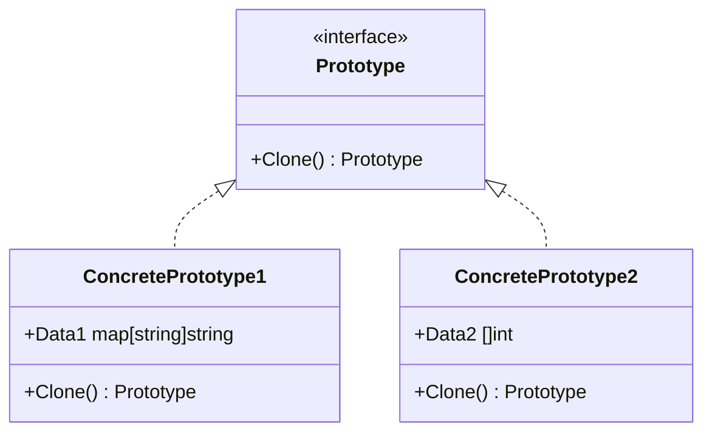

# Prototype Pattern

```mermaid
classDiagram
    class Prototype {
        <<interface>>
        +Clone() Prototype
    }

    class ConcretePrototype1 {
        +Data1 map[string]string
        +Clone() Prototype
    }

    class ConcretePrototype2 {
        +Data2 []int
        +Clone() Prototype
    }

    Prototype <|.. ConcretePrototype1
    Prototype <|.. ConcretePrototype2
```
