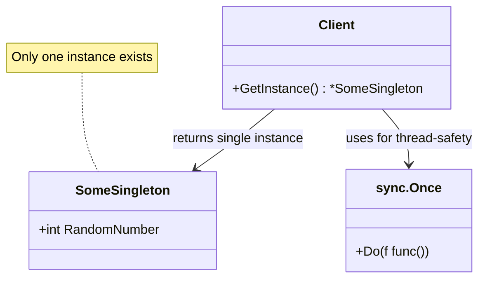

# Singleton Pattern

```mermaid
classDiagram
    class SomeSingleton {
        +int RandomNumber
    }

    class Client {
        +GetInstance() *SomeSingleton
    }

    class sync.Once {
        +Do(f func())
    }

    Client --> SomeSingleton : returns single instance
    Client --> sync.Once : uses for thread-safety

    note for SomeSingleton "Only one instance exists"
```
