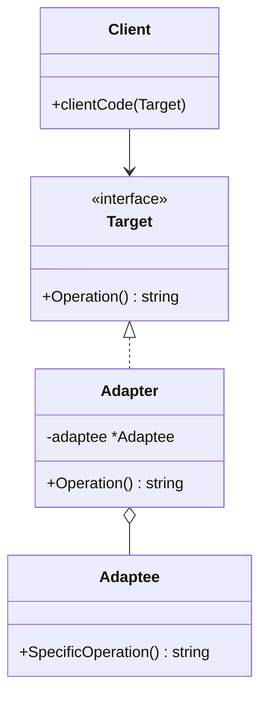

# Adapter Pattern

```mermaid
classDiagram
    class Target {
        <<interface>>
        +Operation() string
    }

    class Adaptee {
        +SpecificOperation() string
    }

    class Adapter {
        -adaptee *Adaptee
        +Operation() string
    }

    class Client {
        +clientCode(Target)
    }

    Target <|.. Adapter
    Adapter o-- Adaptee
    Client --> Target
```
